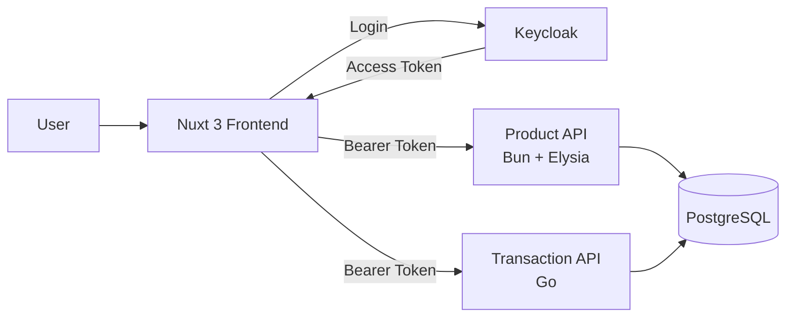
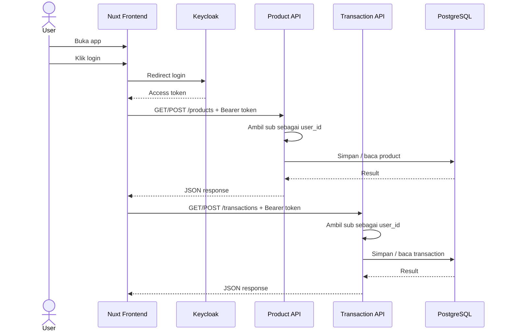

# Panduan Arsitektur Sederhana

Dokumen ini menjadi **acuan tetap** selama semua tahapan implementasi project.

Tujuan utamanya adalah menjaga project tetap **mudah dipahami junior**, **mudah diuji per tahap**, dan **tidak berubah menjadi microservice kompleks** terlalu cepat.

---

## 1. Prinsip utama

> **Arsitektur tetap sederhana, jangan microservice kompleks.**

Makna praktisnya:

- Fokus pada **sistem yang bisa jalan end-to-end** lebih dulu.
- Pisahkan komponen hanya jika **memang sudah jelas tanggung jawabnya**.
- Jangan menambah lapisan baru jika belum ada kebutuhan nyata.
- Setiap tahap harus bisa **dijalankan dan diuji sendiri**.
- Prioritaskan **kode yang mudah dibaca junior** dibanding pola arsitektur yang terlalu canggih.

---

## 2. Scope arsitektur project ini

Stack tetap:

- **Frontend**: Nuxt 3
- **Auth Server / OIDC Provider**: Keycloak
- **Backend API 1**: Bun + Elysia untuk **master data product**
- **Backend API 2**: Go untuk **transaksi**
- **Database**: PostgreSQL

Arsitektur yang dipakai adalah:

- **1 frontend**
- **1 auth server**
- **2 backend API sederhana**
- **1 PostgreSQL**

Bukan target project ini:

- service discovery
- message broker
- event-driven architecture
- distributed tracing yang kompleks
- API Gateway terpisah
- service mesh
- CQRS
- saga pattern
- outbox pattern
- banyak database per service sejak awal
- shared auth service custom buatan sendiri

---

## 3. Diagram acuan utama



Cara baca diagram:

- User berinteraksi lewat **Nuxt**.
- Login dilakukan ke **Keycloak**.
- Setelah login, frontend mendapat **access token**.
- Frontend mengirim token ke **Product API** dan **Transaction API**.
- Kedua backend membaca `sub` dari token sebagai `user_id`.
- Kedua backend menyimpan data ke **PostgreSQL**.

---

## 4. Batas sistem yang harus dipertahankan

### 4.1 Frontend

Tanggung jawab frontend:

- menampilkan halaman
- memulai login ke Keycloak
- menerima callback login
- menyimpan token secara sederhana untuk local development
- memanggil Product API
- memanggil Transaction API
- menampilkan response

Frontend **tidak boleh**:

- memverifikasi signature JWT secara kompleks jika belum dibutuhkan
- memuat business logic berat
- mengelola auth flow custom sendiri di luar OIDC dasar
- langsung akses database

### 4.2 Keycloak

Tanggung jawab Keycloak:

- autentikasi user
- mengeluarkan access token
- menyediakan claim `sub`

Keycloak **tidak boleh** dipakai sebagai:

- tempat business logic aplikasi
- tempat menyimpan data product
- tempat menyimpan data transaction

### 4.3 Product API

Tanggung jawab Product API:

- menyediakan endpoint product
- membaca bearer token
- mengambil `sub` sebagai `user_id`
- menyimpan `created_by`
- CRUD sederhana untuk master data product

Product API **tidak boleh**:

- menangani login user
- menjadi gateway untuk semua service
- memanggil Transaction API tanpa kebutuhan nyata
- memegang terlalu banyak concern lain

### 4.4 Transaction API

Tanggung jawab Transaction API:

- menyediakan endpoint transaksi
- membaca bearer token
- mengambil `sub` sebagai `user_id`
- menyimpan `created_by`
- mengelola data transaksi sederhana

Transaction API **tidak boleh**:

- menangani login user
- menjadi orchestrator sistem yang rumit
- mengambil alih seluruh logic product

### 4.5 PostgreSQL

Tanggung jawab PostgreSQL:

- menyimpan data aplikasi
- tabel `products`
- tabel `transactions`

PostgreSQL di project ini dipakai sebagai **database aplikasi**, bukan sebagai pengganti identity store Keycloak.

---

## 5. Aturan sederhana antar komponen

### 5.1 Aturan komunikasi

Aturan wajib:

- Frontend memanggil backend via **HTTP JSON**.
- Auth antar frontend dan backend memakai **Bearer access token** dari Keycloak.
- Kedua backend membaca `sub` dari token sebagai `user_id`.
- Response API harus sederhana dan konsisten.

Aturan yang sengaja disederhanakan:

- Tidak perlu API Gateway terpisah.
- Tidak perlu komunikasi async antar service.
- Tidak perlu event bus.
- Tidak perlu internal service auth yang rumit.

### 5.2 Aturan database

Untuk fase awal:

- boleh **1 PostgreSQL** untuk semua backend
- boleh memakai **1 database** yang sama
- tabel product dan transaction dipisah jelas

Yang penting:

- tanggung jawab logis tetap jelas
- product data dikelola Product API
- transaction data dikelola Transaction API

### 5.3 Aturan auth

Kedua backend wajib:

- membaca header `Authorization: Bearer <token>`
- mengambil claim `sub`
- menjadikan `sub` sebagai `user_id`
- menaruh `user_id` itu ke `created_by`

Untuk tahap belajar, validasi token boleh dibuat **cukup sederhana** selama flow lokal jelas dan dapat diuji.

---

## 6. API contract global

Gunakan bentuk response yang konsisten.

### Sukses list

```json
{
  "items": []
}
```

### Sukses create / detail

```json
{
  "message": "ok",
  "data": {}
}
```

### Unauthorized

```json
{
  "message": "unauthorized"
}
```

### Bad request

```json
{
  "message": "bad request"
}
```

### Internal server error

```json
{
  "message": "internal server error"
}
```

Tujuannya bukan agar paling sempurna, tetapi agar:

- mudah diuji
- mudah dibaca junior
- konsisten di semua tahap

---

## 7. Endpoint yang menjadi acuan tetap

### Frontend

- `GET /login`
- `GET /auth/callback`
- `GET /profile`
- `GET /products`
- `GET /transactions`

### Product API

- `GET /health`
- `GET /products`
- `POST /products`

### Transaction API

- `GET /health`
- `GET /transactions`
- `POST /transactions`

Di luar daftar ini, **jangan menambah endpoint baru** kecuali memang masuk tahap berikutnya dan benar-benar dibutuhkan.

---

## 8. Aturan implementasi per tahap

Ini bagian paling penting agar setiap tahapan tetap sederhana.

### Tahap 1 — Bootstrap project

Fokus:

- struktur folder
- docker compose
- env
- service dan port

Jangan lakukan:

- auth flow
- business logic
- ORM kompleks
- refactor arsitektur

### Tahap 2 — Setup Keycloak

Fokus:

- realm
- client
- user test
- token test
- pahami `sub`

Jangan lakukan:

- role matrix kompleks
- SSO multi aplikasi
- integrasi LDAP

### Tahap 3 — Nuxt login dasar

Fokus:

- halaman login
- callback
- simpan token sederhana
- tampilkan profile dari token

Jangan lakukan:

- state management kompleks
- UI yang terlalu rapi dulu
- refresh token flow kompleks

### Tahap 4 — Product API

Fokus:

- middleware auth
- ambil `sub`
- endpoint `/health`
- endpoint `/products`

Jangan lakukan:

- transaksi
- integrasi service ke service
- repository pattern berlapis-lapis

### Tahap 5 — Transaction API

Fokus:

- middleware auth
- ambil `sub`
- endpoint `/health`
- endpoint `/transactions`

Jangan lakukan:

- orchestration rumit
- call ke Product API tanpa kebutuhan nyata
- clean architecture berlebihan

### Tahap 6 — PostgreSQL

Fokus:

- migration sederhana
- tabel `products`
- tabel `transactions`
- ubah penyimpanan dari in-memory ke DB

Jangan lakukan:

- ORM berat kalau belum perlu
- optimasi prematur
- refactor besar

### Tahap 7 — Nuxt ke Product API

Fokus:

- list product
- create product
- kirim bearer token

Jangan lakukan:

- transaksi sekaligus
- UI design yang rumit
- banyak abstraction frontend

### Tahap 8 — Nuxt ke Transaction API

Fokus:

- list transaction
- create transaction
- kirim bearer token

Jangan lakukan:

- checkout flow kompleks
- integrasi lintas backend yang belum perlu

### Tahap 9 — Review akhir

Fokus:

- pastikan endpoint jalan
- pastikan contract konsisten
- pastikan `created_by` terisi dari `sub`
- pastikan end-to-end flow berhasil

Jangan lakukan:

- tambah fitur baru
- ubah arsitektur
- refactor besar

---

## 9. Checklist keputusan arsitektur

Sebelum menambah sesuatu, cek pertanyaan ini.

### Tambahkan komponen baru hanya jika jawabannya “ya”

1. Apakah ini benar-benar dibutuhkan oleh tahap sekarang?
2. Apakah tanpa ini flow utama tidak bisa diuji?
3. Apakah ini membuat sistem lebih mudah dipahami junior?
4. Apakah ini tidak menambah terlalu banyak concern baru?

Kalau jawaban mayoritas **tidak**, berarti **jangan ditambahkan dulu**.

---

## 10. Anti-pattern yang harus dihindari

Jangan lakukan hal-hal berikut pada project ini:

- membuat API Gateway padahal backend masih 2 service sederhana
- membuat shared internal SDK terlalu cepat
- memisahkan database per service tanpa alasan kuat
- menambahkan queue/event bus tanpa use case nyata
- membuat auth service custom padahal sudah ada Keycloak
- memindahkan business logic ke frontend
- mencampur logic product dan transaksi dalam satu endpoint besar
- membuat lapisan `controller -> usecase -> service -> repository -> adapter -> facade` jika isinya masih sangat tipis

Tujuan project ini adalah **jelas dan berjalan**, bukan **terlihat enterprise**.

---

## 11. Struktur folder acuan

Contoh acuan sederhana:

```text
.
├── apps/
│   ├── web/                 # Nuxt 3
│   ├── product-api/         # Bun + Elysia
│   └── transaction-api/     # Go
├── infra/
│   ├── docker/
│   └── keycloak/
├── migrations/
├── docs/
│   └── SIMPLE_ARCHITECTURE_GUIDE.md
├── .env.example
└── docker-compose.yml
```

Tetap jaga agar struktur ini tidak berkembang liar sebelum memang dibutuhkan.

---

## 12. Definisi sederhana tiap komponen

### Frontend
Tempat user klik, lihat halaman, kirim request.

### Keycloak
Tempat login dan tempat mengambil token.

### Product API
Tempat logic master data product.

### Transaction API
Tempat logic transaksi.

### PostgreSQL
Tempat simpan data aplikasi.

Kalau masih bingung, pegang rumus ini:

> **Login ke Keycloak, data bisnis ke backend, simpan data ke PostgreSQL.**

---

## 13. Flow acuan end-to-end



---

## 14. Aturan perubahan dokumen ini

Dokumen ini **tidak boleh diubah** hanya karena AI model mengusulkan arsitektur yang lebih canggih.

Dokumen ini hanya boleh diubah jika:

- ada kebutuhan nyata baru
- semua tahap sederhana sudah stabil
- perubahan benar-benar disetujui sebagai kebutuhan project

Kalau tidak, maka aturan default tetap:

> **Arsitektur tetap sederhana, jangan microservice kompleks.**

---

## 15. Ringkasan singkat

Pegang 5 hal ini:

1. **Frontend hanya untuk UI + panggil API**
2. **Keycloak hanya untuk login + token**
3. **Product API hanya untuk product**
4. **Transaction API hanya untuk transaksi**
5. **PostgreSQL hanya untuk data aplikasi**

Dan pegang 1 aturan besar ini:

> **Tambahkan kompleksitas hanya kalau flow utama benar-benar membutuhkannya.**
