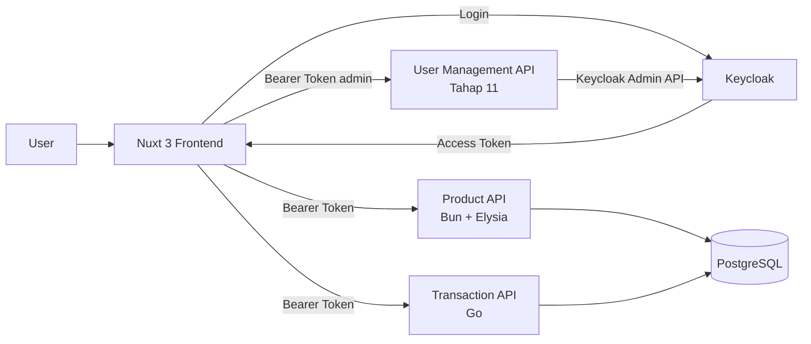
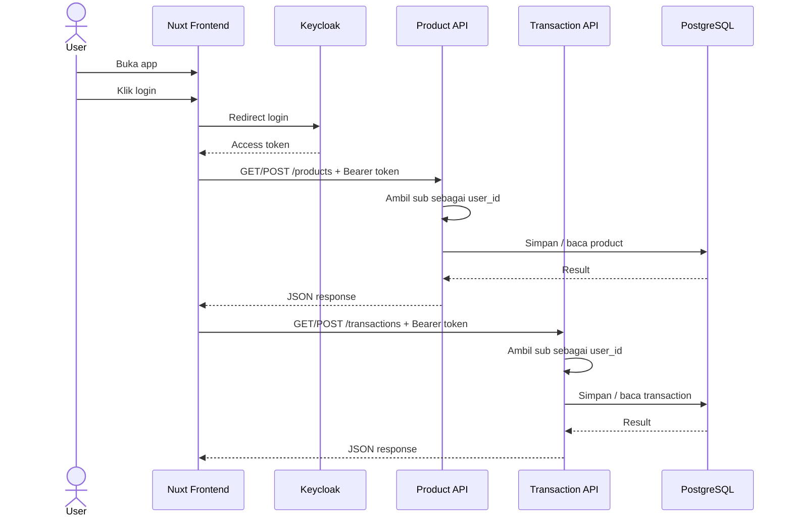
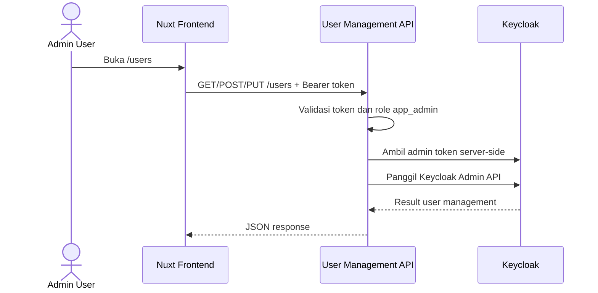

# Panduan Arsitektur Sederhana

Dokumen ini menjadi **acuan tetap** selama semua tahapan implementasi project.

Tujuan utamanya adalah menjaga project tetap **mudah dipahami junior**, **mudah diuji per tahap**, dan **tidak berubah menjadi microservice kompleks** terlalu cepat.

---

## 1. Prinsip utama

> **Arsitektur tetap sederhana, jangan microservice kompleks.**

Makna praktisnya:

- Fokus pada **sistem yang bisa jalan end-to-end** lebih dulu.
- Pisahkan komponen hanya jika **memang sudah jelas tanggung jawabnya**.
- Jangan menambah lapisan baru jika belum ada kebutuhan nyata.
- Setiap tahap harus bisa **dijalankan dan diuji sendiri**.
- Prioritaskan **kode yang mudah dibaca junior** dibanding pola arsitektur yang terlalu canggih.

---

## 2. Scope arsitektur project ini

Stack tetap:

- **Frontend**: Nuxt 3
- **Auth Server / OIDC Provider**: Keycloak
- **Backend API 1**: Bun + Elysia untuk **master data product**
- **Backend API 2**: Go untuk **transaksi**
- **Database**: PostgreSQL

Tambahan mulai **Tahap 11**:

- **User Management API**: Bun + Elysia, backend kecil khusus untuk **admin user management** melalui Keycloak Admin API

Arsitektur yang dipakai adalah:

- **1 frontend**
- **1 auth server**
- **2 backend API bisnis sederhana**
- **1 backend admin sederhana mulai Tahap 11**
- **1 PostgreSQL**

Port local development yang dipakai:

| Service | Port | Catatan |
| --- | --- | --- |
| Nuxt web app | `7011` | frontend |
| Product API | `7012` | Bun + Elysia untuk product |
| Transaction API | `7013` | Go untuk transaksi |
| User Management API | `7014` | Bun + Elysia untuk admin user management mulai Tahap 11 |
| Keycloak | `7070` | OIDC provider |
| PostgreSQL | `5432` | database aplikasi |

Contoh mapping request dari frontend:

```text
Nuxt /products      -> http://localhost:7012/products
Nuxt /transactions  -> http://localhost:7013/transactions
Nuxt /users         -> http://localhost:7014/users
```

Bukan target project ini:

- service discovery
- message broker
- event-driven architecture
- distributed tracing yang kompleks
- API Gateway terpisah
- service mesh
- CQRS
- saga pattern
- outbox pattern
- banyak database per service sejak awal
- shared auth service custom buatan sendiri
- user management langsung dari browser ke Keycloak Admin API

---

## 3. Diagram acuan utama



Cara baca diagram:

- User berinteraksi lewat **Nuxt**.
- Login dilakukan ke **Keycloak**.
- Setelah login, frontend mendapat **access token**.
- Frontend mengirim token ke **Product API** dan **Transaction API**.
- Product API dan Transaction API membaca `sub` dari token sebagai `user_id`.
- Product API dan Transaction API menyimpan data ke **PostgreSQL**.
- Mulai Tahap 11, frontend juga dapat memanggil **User Management API** untuk fitur `/users`.
- User Management API memvalidasi token admin, lalu memanggil **Keycloak Admin API** dari server-side.

---

## 4. Batas sistem yang harus dipertahankan

### 4.1 Frontend

Tanggung jawab frontend:

- menampilkan halaman
- memulai login ke Keycloak
- menerima callback login
- menyimpan token secara sederhana untuk local development
- memanggil Product API
- memanggil Transaction API
- memanggil User Management API untuk menu admin `/users` mulai Tahap 11
- menampilkan response

Frontend **tidak boleh**:

- memverifikasi signature JWT secara kompleks jika belum dibutuhkan
- memuat business logic berat
- mengelola auth flow custom sendiri di luar OIDC dasar
- langsung akses database
- langsung memanggil Keycloak Admin API
- menyimpan credential admin Keycloak

### 4.2 Keycloak

Tanggung jawab Keycloak:

- autentikasi user
- mengeluarkan access token
- menyediakan claim `sub`
- menyimpan data user sebagai identity store
- menyediakan role sederhana seperti `app_admin` untuk Tahap 11

Keycloak **tidak boleh** dipakai sebagai:

- tempat business logic aplikasi
- tempat menyimpan data product
- tempat menyimpan data transaction

### 4.3 Product API

Tanggung jawab Product API:

- menyediakan endpoint product
- membaca bearer token
- mengambil `sub` sebagai `user_id`
- menyimpan `created_by`
- CRUD sederhana untuk master data product

Product API **tidak boleh**:

- menangani login user
- menjadi gateway untuk semua service
- memanggil Transaction API tanpa kebutuhan nyata
- memegang terlalu banyak concern lain

### 4.4 Transaction API

Tanggung jawab Transaction API:

- menyediakan endpoint transaksi
- membaca bearer token
- mengambil `sub` sebagai `user_id`
- menyimpan `created_by`
- mengelola data transaksi sederhana

Transaction API **tidak boleh**:

- menangani login user
- menjadi orchestrator sistem yang rumit
- mengambil alih seluruh logic product

### 4.5 PostgreSQL

Tanggung jawab PostgreSQL:

- menyimpan data aplikasi
- tabel `products`
- tabel `transactions`
- tabel tambahan aplikasi jika benar-benar dibutuhkan pada tahap berikutnya, misalnya `user_profiles`

PostgreSQL di project ini dipakai sebagai **database aplikasi**, bukan sebagai pengganti identity store Keycloak.

### 4.6 User Management API

Tanggung jawab User Management API:

- menyediakan endpoint admin user management mulai Tahap 11
- berjalan sebagai service terpisah di `apps/user-api/`
- memakai **Bun + Elysia** agar konsisten dengan Product API
- memakai port local development sendiri, yaitu `7014`
- membaca bearer token dari frontend
- memvalidasi bahwa user punya role `app_admin`
- mengambil admin access token Keycloak dari credential server-side
- memanggil Keycloak Admin API untuk list, create, dan update user
- menyembunyikan credential admin Keycloak dari browser

User Management API **tidak boleh**:

- menggantikan Keycloak sebagai identity provider
- menangani login user
- menyimpan password user di PostgreSQL aplikasi
- mencampur logic product atau transaksi
- menjadi API Gateway untuk semua service
- membuat role matrix kompleks pada tahap awal

---

## 5. Aturan sederhana antar komponen

### 5.1 Aturan komunikasi

Aturan wajib:

- Frontend memanggil backend via **HTTP JSON**.
- Auth antar frontend dan backend memakai **Bearer access token** dari Keycloak.
- Product API dan Transaction API membaca `sub` dari token sebagai `user_id`.
- User Management API membaca token yang sama, tetapi endpoint admin wajib cek role `app_admin`.
- User Management API memanggil Keycloak Admin API memakai credential server-side, bukan credential dari frontend.
- Response API harus sederhana dan konsisten.

Aturan yang sengaja disederhanakan:

- Tidak perlu API Gateway terpisah.
- Tidak perlu komunikasi async antar service.
- Tidak perlu event bus.
- Tidak perlu internal service auth yang rumit.
- Tidak perlu frontend memanggil Keycloak Admin API langsung.

### 5.2 Aturan database

Untuk fase awal:

- boleh **1 PostgreSQL** untuk semua backend
- boleh memakai **1 database** yang sama
- tabel product dan transaction dipisah jelas

Yang penting:

- tanggung jawab logis tetap jelas
- product data dikelola Product API
- transaction data dikelola Transaction API
- user identity tetap dikelola Keycloak
- data profile lokal seperti `user_profiles` hanya boleh menjadi cache/display aplikasi, bukan sumber utama identity

### 5.3 Aturan auth

Product API dan Transaction API wajib:

- membaca header `Authorization: Bearer <token>`
- mengambil claim `sub`
- menjadikan `sub` sebagai `user_id`
- menaruh `user_id` itu ke `created_by`

User Management API wajib:

- membaca header `Authorization: Bearer <token>`
- memvalidasi token
- memastikan token punya role `app_admin`
- mengembalikan `401` jika token tidak ada atau tidak valid
- mengembalikan `403` jika token valid tetapi bukan admin

Untuk tahap belajar, validasi token boleh dibuat **cukup sederhana** selama flow lokal jelas dan dapat diuji.

---

## 6. API contract global

Gunakan bentuk response yang konsisten.

### Sukses list

```json
{
  "items": []
}
```

### Sukses create / detail

```json
{
  "message": "ok",
  "data": {}
}
```

### Unauthorized

```json
{
  "message": "unauthorized"
}
```

### Bad request

```json
{
  "message": "bad request"
}
```

### Forbidden

```json
{
  "message": "forbidden"
}
```

### Internal server error

```json
{
  "message": "internal server error"
}
```

Tujuannya bukan agar paling sempurna, tetapi agar:

- mudah diuji
- mudah dibaca junior
- konsisten di semua tahap

---

## 7. Endpoint yang menjadi acuan tetap

### Frontend

- `GET /login`
- `GET /auth/callback`
- `GET /profile`
- `GET /products`
- `GET /transactions`
- `GET /users` mulai Tahap 11

### Product API

- `GET /health`
- `GET /products`
- `POST /products`

### Transaction API

- `GET /health`
- `GET /transactions`
- `POST /transactions`

### User Management API

- `GET /health`
- `GET /users`
- `POST /users`
- `PUT /users/:id`

Base URL local development:

```text
http://localhost:7014
```

Di luar daftar ini, **jangan menambah endpoint baru** kecuali memang masuk tahap berikutnya dan benar-benar dibutuhkan.

---

## 8. Aturan implementasi per tahap

Ini bagian paling penting agar setiap tahapan tetap sederhana.

### Tahap 1 — Bootstrap project

Fokus:

- struktur folder
- docker compose
- env
- service dan port

Jangan lakukan:

- auth flow
- business logic
- ORM kompleks
- refactor arsitektur

### Tahap 2 — Setup Keycloak

Fokus:

- realm
- client
- user test
- token test
- pahami `sub`

Jangan lakukan:

- role matrix kompleks
- SSO multi aplikasi
- integrasi LDAP

### Tahap 3 — Nuxt login dasar

Fokus:

- halaman login
- callback
- simpan token sederhana
- tampilkan profile dari token

Jangan lakukan:

- state management kompleks
- UI yang terlalu rapi dulu
- refresh token flow kompleks

### Tahap 4 — Product API

Fokus:

- middleware auth
- ambil `sub`
- endpoint `/health`
- endpoint `/products`

Jangan lakukan:

- transaksi
- integrasi service ke service
- repository pattern berlapis-lapis

### Tahap 5 — Transaction API

Fokus:

- middleware auth
- ambil `sub`
- endpoint `/health`
- endpoint `/transactions`

Jangan lakukan:

- orchestration rumit
- call ke Product API tanpa kebutuhan nyata
- clean architecture berlebihan

### Tahap 6 — PostgreSQL

Fokus:

- migration sederhana
- tabel `products`
- tabel `transactions`
- ubah penyimpanan dari in-memory ke DB

Jangan lakukan:

- ORM berat kalau belum perlu
- optimasi prematur
- refactor besar

### Tahap 7 — Nuxt ke Product API

Fokus:

- list product
- create product
- kirim bearer token

Jangan lakukan:

- transaksi sekaligus
- UI design yang rumit
- banyak abstraction frontend

### Tahap 8 — Nuxt ke Transaction API

Fokus:

- list transaction
- create transaction
- kirim bearer token

Jangan lakukan:

- checkout flow kompleks
- integrasi lintas backend yang belum perlu

### Tahap 9 — Review akhir

Fokus:

- pastikan endpoint jalan
- pastikan contract konsisten
- pastikan `created_by` terisi dari `sub`
- pastikan end-to-end flow berhasil

Jangan lakukan:

- tambah fitur baru
- ubah arsitektur
- refactor besar

### Tahap 10 — Penyempurnaan web app

Fokus:

- tombol logout sederhana
- select product pada halaman transaksi
- hitung `total_price` otomatis dari product terpilih dan `qty`

Jangan lakukan:

- ubah endpoint backend
- ubah database schema
- refresh token flow kompleks
- integrasi service-to-service yang belum perlu

### Tahap 11 — User Management

Fokus:

- tambah service kecil `apps/user-api/`
- gunakan **Bun + Elysia**
- jalankan di port `7014`
- endpoint `GET /health`, `GET /users`, `POST /users`, `PUT /users/:id`
- halaman Nuxt `/users`
- validasi role `app_admin`
- panggil Keycloak Admin API dari backend
- simpan credential admin Keycloak hanya di env User Management API

Env yang perlu disiapkan:

- `USER_API_PORT=7014`
- `USER_API_BASE_URL=http://localhost:7014`
- `KEYCLOAK_BASE_URL`
- `KEYCLOAK_REALM`
- credential admin Keycloak untuk dipakai **hanya oleh User Management API**

Jangan lakukan:

- panggil Keycloak Admin API langsung dari Nuxt
- simpan password user di PostgreSQL aplikasi
- campur user management ke Product API atau Transaction API
- buat auth service custom
- buat role matrix kompleks
- tambah API Gateway, queue, atau service discovery

---

## 9. Checklist keputusan arsitektur

Sebelum menambah sesuatu, cek pertanyaan ini.

### Tambahkan komponen baru hanya jika jawabannya “ya”

1. Apakah ini benar-benar dibutuhkan oleh tahap sekarang?
2. Apakah tanpa ini flow utama tidak bisa diuji?
3. Apakah ini membuat sistem lebih mudah dipahami junior?
4. Apakah ini tidak menambah terlalu banyak concern baru?

Kalau jawaban mayoritas **tidak**, berarti **jangan ditambahkan dulu**.

---

## 10. Anti-pattern yang harus dihindari

Jangan lakukan hal-hal berikut pada project ini:

- membuat API Gateway padahal backend bisnis dan admin masih sederhana
- membuat shared internal SDK terlalu cepat
- memisahkan database per service tanpa alasan kuat
- menambahkan queue/event bus tanpa use case nyata
- membuat auth service custom padahal sudah ada Keycloak
- memindahkan business logic ke frontend
- mencampur logic product dan transaksi dalam satu endpoint besar
- mencampur user management ke Product API atau Transaction API
- memanggil Keycloak Admin API langsung dari frontend
- menyimpan credential admin Keycloak di Nuxt
- menyimpan password user di database aplikasi
- membuat lapisan `controller -> usecase -> service -> repository -> adapter -> facade` jika isinya masih sangat tipis

Tujuan project ini adalah **jelas dan berjalan**, bukan **terlihat enterprise**.

---

## 11. Struktur folder acuan

Contoh acuan sederhana:

```text
.
├── apps/
│   ├── web/                 # Nuxt 3
│   ├── product-api/         # Bun + Elysia
│   ├── transaction-api/     # Go
│   └── user-api/            # User Management API mulai Tahap 11
├── infra/
│   ├── docker/
│   └── keycloak/
├── migrations/
├── docs/
│   └── SIMPLE_ARCHITECTURE_GUIDE.md
├── .env.example
└── docker-compose.yml
```

Tetap jaga agar struktur ini tidak berkembang liar sebelum memang dibutuhkan.

---

## 12. Definisi sederhana tiap komponen

### Frontend
Tempat user klik, lihat halaman, kirim request.

### Keycloak
Tempat login dan tempat mengambil token.

### Product API
Tempat logic master data product.

### Transaction API
Tempat logic transaksi.

### User Management API
Tempat logic admin user management yang memanggil Keycloak Admin API dari backend.

### PostgreSQL
Tempat simpan data aplikasi.

Kalau masih bingung, pegang rumus ini:

> **Login ke Keycloak, data bisnis ke backend, simpan data ke PostgreSQL.**

Untuk Tahap 11, tambahkan rumus ini:

> **Kelola user lewat User Management API, tetapi identity user tetap milik Keycloak.**

---

## 13. Flow acuan end-to-end



Flow tambahan Tahap 11 untuk user management:



---

## 14. Aturan perubahan dokumen ini

Dokumen ini **tidak boleh diubah** hanya karena AI model mengusulkan arsitektur yang lebih canggih.

Dokumen ini hanya boleh diubah jika:

- ada kebutuhan nyata baru
- semua tahap sederhana sudah stabil
- perubahan benar-benar disetujui sebagai kebutuhan project

Kalau tidak, maka aturan default tetap:

> **Arsitektur tetap sederhana, jangan microservice kompleks.**

---

## 15. Ringkasan singkat

Pegang 6 hal ini:

1. **Frontend hanya untuk UI + panggil API**
2. **Keycloak hanya untuk login + token**
3. **Product API hanya untuk product**
4. **Transaction API hanya untuk transaksi**
5. **User Management API hanya untuk admin user management**
6. **PostgreSQL hanya untuk data aplikasi**

Dan pegang 1 aturan besar ini:

> **Tambahkan kompleksitas hanya kalau flow utama benar-benar membutuhkannya.**
